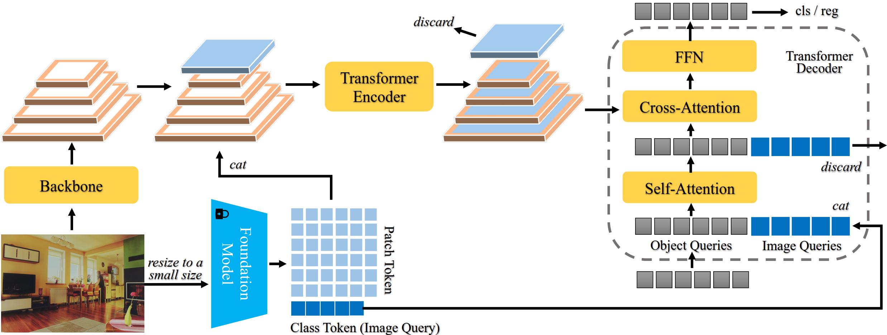

## Frozen-DETR: Enhancing DETR with Image Understanding from Frozen Foundation Models

This is the official PyTorch implementation of [Frozen-DETR](https://arxiv.org/abs/2410.19635) (NeurIPS 2024).



### 1 Introduction

Recent vision foundation models can extract universal representations and show impressive abilities in various tasks. However, their application on object detection is largely overlooked, especially without fine-tuning them. In this work, we show that frozen foundation models can be a versatile feature enhancer, even though they are not pre-trained for object detection. Specifically, we explore directly transferring the high-level image understanding of foundation models to detectors in the following two ways. First, the class token in foundation models provides an in-depth understanding of the complex scene, which facilitates decoding object queries in the detector’s decoder by providing a compact context. Additionally, the patch tokens in foundation models can enrich the features in the detector’s encoder by providing semantic details. Utilizing frozen foundation models as plug-and-play modules rather than the commonly used backbone can significantly enhance the detector’s performance while preventing the problems caused by the architecture discrepancy between the detector’s backbone and the foundation model. With such a novel paradigm, we boost the SOTA query-based detector DINO from 49.0% AP to 51.9% AP (+2.9% AP) and further to 53.8% AP (+4.8% AP) by integrating one or two foundation models respectively, on the COCO validation set after training for 12 epochs with R50 as the detector’s backbone.


### 2 TODO

- [ ] Release the code of other DETR models (DAB-DETR, DN-DETR, MS-DETR, HPR)
- [x] Release the code of DINO and Co-DINO

### 3 Data preparation

We expect the directory structure to be the following:

```
｜--Frozen-DETR-ckpt # download our pretrained models to this folder
｜--Co-DINO_AdaMixer_DINO-lvis # code for Co-Dino, AdaMixer, and DINO on LVIS dataset
｜--DINO-coco # code for DINO on COCO dataset
｜--dataset
	|--coco
		|--annotations
			|--instances_train2017.json
			|--instances_val2017.json
		|--train2017
		|--val2017
	|--lvis_v1
		|--annotations
			|--lvis_v1_train.json  # for stardard setting
			|--lvis_v1_train_seen.json  # for open-vocabulary setting
			|--lvis_v1_val.json
		|--train2017
		|--val2017
|--pretrained_models
	|--dinov2_vitl14_pretrain.pth
	|--lvis_base_inds.txt
	|--swin_base_patch4_window7_224_22k.pth
	|--torchvision_resnet50.pth
	|--ViT-L-14-336px.pt
```

- `dinov2_vitl14_pretrain.pth`: [download link](https://dl.fbaipublicfiles.com/dinov2/dinov2_vitl14/dinov2_vitl14_pretrain.pth)
- `ViT-L-14-336px.pt`: [download link](https://openaipublic.azureedge.net/clip/models/3035c92b350959924f9f00213499208652fc7ea050643e8b385c2dac08641f02/ViT-L-14-336px.pt)
- `swin_base_patch4_window7_224_22k.pth`: [download link](https://github.com/SwinTransformer/storage/releases/download/v1.0.0/swin_base_patch4_window7_224_22k.pth)
- `lvis_v1_train_seen.json`: [download link](https://drive.google.com/file/d/1dZQ5ytHgJPv4VgYOyjJerq4adc6GQkkd/view?usp=sharing)
- `torchvision_resnet50.pth`: [download link](https://download.pytorch.org/models/resnet50-0676ba61.pth)

### 4 Models

Please see `Co-DINO_AdaMixer_DINO-lvis`, `DINO-coco` and `MS-DETR` for details.

### 5 License

Frozen-DETR is released under the Apache 2.0 license. Please see the LICENSE file for more information.

### 6 Bibtex

If you find our work helpful for your research, please consider citing the following BibTeX entry.

```
@inproceedings{fu2024frozen-detr,
  title={Frozen-DETR: Enhancing DETR with Image Understanding from Frozen Foundation Models},
  author={Fu, Shenghao and Yan, Junkai and Yang, Qize and Wei, Xihan and Xie, Xiaohua and Zheng, Wei-Shi},
  booktitle={NeurIPS},
  year={2024},
}
```

